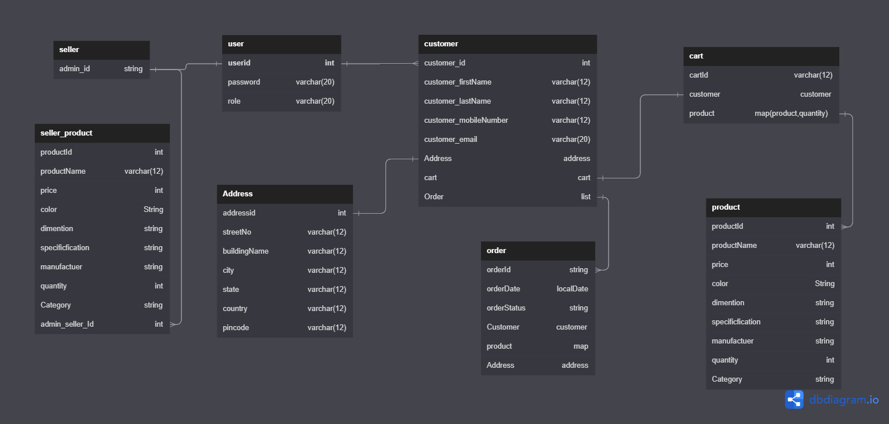

<h1 align="center">SellerToCart</h1>
<h2 align="center">A Backend project providing Rest Api for online shopping application. The Api can perform all the crud operation with customer validation on every step.</h2>
 
<h1>Modules</h1>
<ul>
<li><h3>Login Module</h3></li>
  <li><h3>Customer Module</h3></li>
  <li><h3>Product Module</h3></li>
  <li><h3>Order Module</h3></li>
  <li><h3>Cart Module</h3></li>
</ul>
<h1>Deployed Link</h1>
<ul><li><a target="_blank" href="http://onlineshop-env.eba-cxymjmdv.ap-northeast-1.elasticbeanstalk.com/swagger-ui/">Live Project Link</a></li></ul>

# Project Schema Plan

